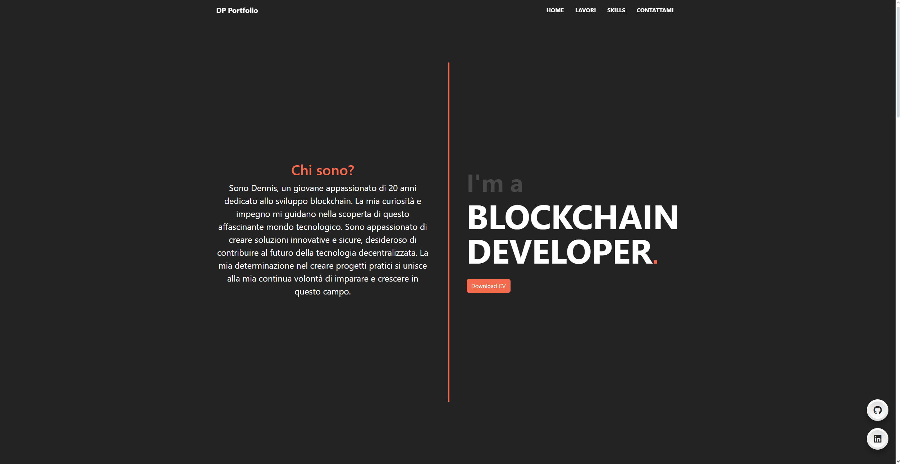
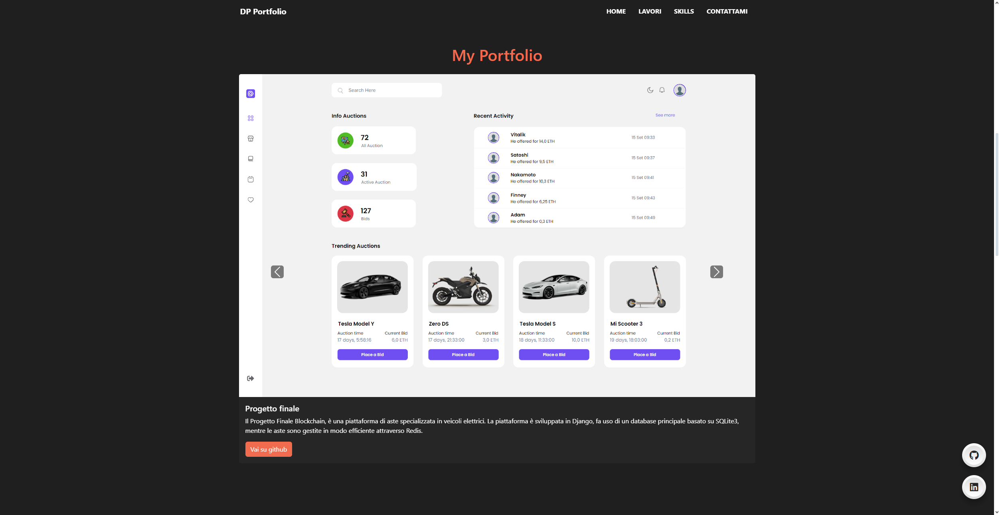
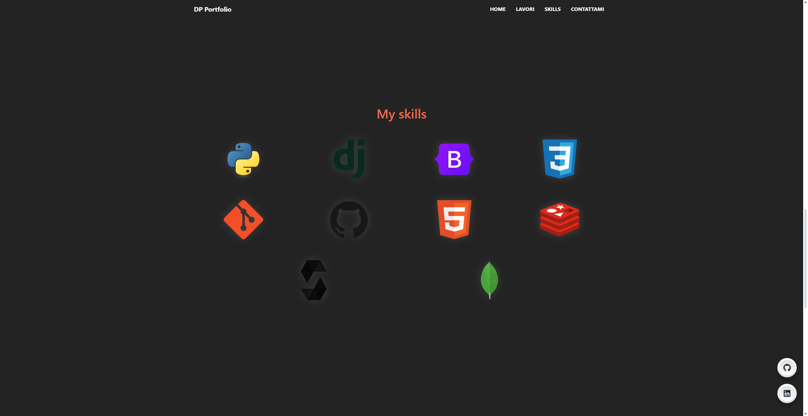
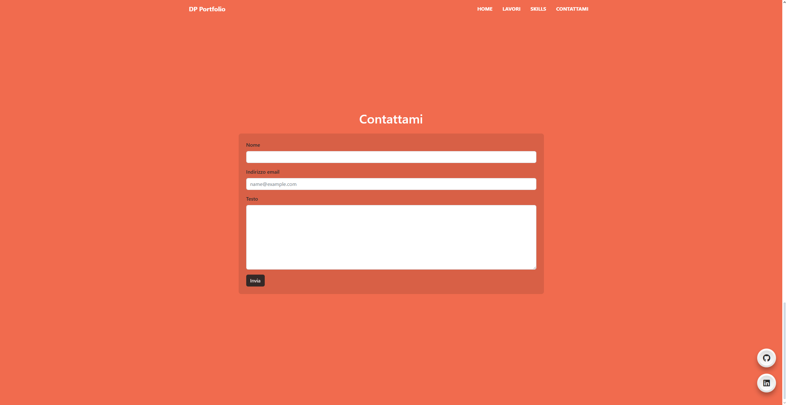

# Il mio Portfolio

## Descrizione  
Il sito web è stato progettato per una presentazione chiara e minimale. Realizzato su una singola pagina, utilizzando HTML, CSS, il framework Bootstrap e JavaScript. Il suo scopo è presentare in modo sintetico chi sono e le mie competenze, evidenziando i progetti realizzati, ed il mio curriculum.
### [Presentazione](https://www.canva.com/design/DAF1iTyKHqY/sFkvff0IIGi_zMaVuro4RA/view?utm_content=DAF1iTyKHqY&utm_campaign=designshare&utm_medium=link&utm_source=editor)

## Struttura del sito
- **Home**

    

 

- **Lavori**

    

- **Skills**

    

 

- **Contattami**

    

 
